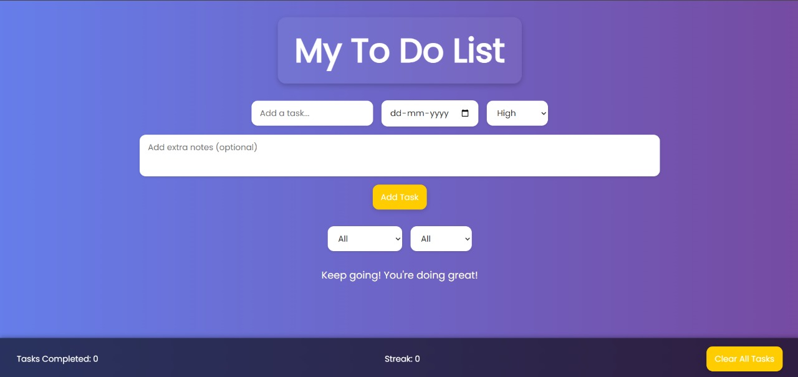

# 📝 Modern To-Do List Web App

A sleek and user-friendly to-do list tool built with **HTML**, **CSS**, and **JavaScript** — designed to help you manage tasks, stay productive, and track progress in a visually engaging way.

## 🚀 Features

- ✅ **Add, Complete, and Delete Tasks**
- 📅 **Due Date Selection**
- 🔥 **Priority Tagging (Low, Medium, High)**
- 🗒️ **Optional Notes per Task**
- 🎯 **Completion Tracking & Streak Counter**
- 💡 **Motivational Messages**
- 🔍 **Filter by Status & Priority**
- 🧹 **Clear All Tasks**
- 💅 **Beautiful Responsive UI with Animations**

## 📸 Preview

 <!-- You can replace this with your actual screenshot -->
  

## 📂 Project Structure

```
├── index.html # Main HTML file
├── styles.css # CSS styling with modern UI
├── script.js # JavaScript functionality
└── README.md # Project documentation
```


## 💡 How to Use

1. Clone or download the repository.
2. Open `index.html` in any modern browser.
3. Start adding tasks, selecting priorities, and managing your list!

## ✨ Tech Stack

- **HTML5** for structure
- **CSS3** for styling and responsive layout
- **JavaScript (Vanilla)** for logic and interactivity
- **Google Fonts** & **Font Awesome** for improved visuals

## 📌 To-Do / Ideas for Improvement

- [ ] Local storage for task persistence
- [ ] Light/Dark theme toggle
- [ ] Drag and drop task reordering
- [ ] Calendar sync or reminders
- [ ] Real-time collaboration

## 🧑‍💻 Author

Built by [Shashank Rao U, Shivani, Samitha, Thanvi]

## 📄 License

This project is licensed under the MIT License.

